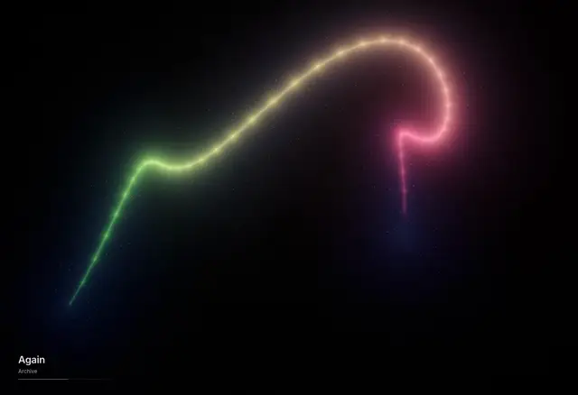

# Serein

A listening instrument. Give it a browser tab that is playing music and it
answers in light — five full-screen presets driven by what the music is actually
doing, not by a level meter.

## Serein in Motion

<p align="center">
  
</p>

Audio analysis and rendering happen locally, and no audio leaves the machine.
Spotify integration is optional and only calls Spotify's API for track
metadata.

## Run it

```bash
bun install
bun run dev      # http://127.0.0.1:5173
```

`bun run build` type-checks and produces a static bundle in `dist/`.

## Giving it sound

- **Tab** — pick a browser tab in Chrome's picker and keep *Also share tab
  audio* switched on. The tab keeps playing through your speakers.
- **Room** — the microphone, for a record player or a live room.
- **File** — drop an audio file anywhere on the window, or press `O`.
  `Artist - Title.flac` is parsed into artist and title.
- **Spotify** — optionally connect for the current title, artist, timeline and
  playback controls. Spotify supplies metadata and transport; Tab, Room or File
  still supplies the sound. Playback controls require Spotify Premium. Existing
  connections need to disconnect and reconnect once to grant control permission.

With nothing connected the field keeps breathing on a slow synthetic signal.

## Keys

Press `H` in the app for the full list.

| | |
|---|---|
| `space` | Spotify play / pause |
| `n` | next preset |
| `←` / `→` | previous / next Spotify track |
| `1`–`5` | choose a preset |
| `c` / `shift c` | next / previous colour world |
| `l` / `m` / `o` | tab / room / file |
| `s` | connect or disconnect Spotify |
| `r` | recompose (new seed) |
| `f` | fullscreen |
| `u` | hide the controls |
| `t` | hide what is playing |
| `h` / `?` | keys |

## The presets

| | |
|---|---|
| **Veil** | a membrane held between low and high |
| **Bloom** | ink released into water, one ring every two beats |
| **Coil** | one long body, the spectrum along its length |
| **Ink** | pigment lit from inside, pushed by the low end |
| **Harp** | sixteen strings, struck and left to ring |

Thirteen colour worlds sit on top, and they cross-dissolve rather than cut:
**Native** (each preset's own palette), then Ember, Glacier, Nocturne, Iris,
Cinder, Peony, Verdigris, Absinthe, Tide, Copper, Bruise and Aurora. Each ramp
is internally harmonic; the set runs from near-monochrome to fully chromatic.
They live in one table in `src/gl/palettes.ts`, which also generates the
shader's `world()`.

## How it listens

`src/audio/listener.ts` turns the signal into a small set of expressive numbers
and nothing downstream touches the audio directly:

- Seven auto-gained bands, so a quiet lo-fi tab and a loud master both fill the
  same range within a few seconds.
- Separate onset envelopes for kick, snare and hats, each with adaptive
  thresholds — fast attack, musical decay.
- Tempo by autocorrelation of the onset envelope, resampled to a steady 60 Hz,
  giving a BPM estimate and an unwrapped beat counter. Bloom releases exactly
  one ring every two beats off that counter.
- Spectral centroid (brightness) and flatness (tonal vs noisy).
- Short-term against long-term loudness, for swells and drops.
- Two spectra, not one: a fast one that hears transients, and a slow one that
  hears sustained instruments.
- A **motion rate** from tempo and loudness, which drives the `u_flow` clock.

## Structure

```
src/
  audio/listener.ts     capture, feature extraction, tempo
  gl/shared.ts          GLSL prelude, colour worlds, post chain
  gl/renderer.ts        program cache, crossfades, adaptive resolution
  gl/presets/*.ts       one fragment-shader body each
  spotify.ts            optional Spotify metadata via PKCE
  ui/                   overlay, controls, now playing
```

Each preset implements `vec3 scene(vec2 uv, vec2 st)` plus its own
`nativeRamp`, and is wrapped with the shared uniforms and post chain. Adding one
means writing a file and adding a line to `gl/presets/index.ts`.

Four things worth knowing before editing shaders:

- Animate on `u_flow`, never `u_time`. `u_flow` is a clock that runs at the
  speed of the music, so a slow record does not get a busy picture. `u_time` is
  only for things that must not slow down, like film grain.
- Take geometry from `specSlow()` and light from `spec()`. Shape should follow
  sustained instruments; only brightness should follow transients. Getting this
  backwards is what makes a preset feel nervous.
- Use `spow(x, k)`, never `pow`. `pow(0.0, k)` returns NaN on real drivers, and
  one NaN turns the whole pixel black.
- The frame is sized by a pixel budget (`Renderer.maxPixels`), not by the
  display, and the renderer lowers resolution on its own if frames run long.
  These shaders are fill-rate bound; on a 5K panel the unbudgeted frame is 15
  million pixels.
